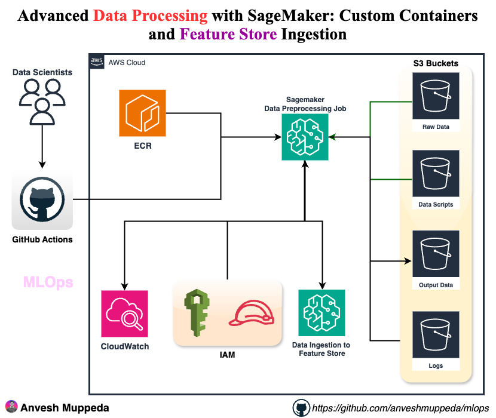

# Advanced Data Processing with SageMaker: Custom Containers and Feature Store Ingestion
### A hands-on guide to building production-grade ML infrastructure with custom scikit-learn containers, SageMaker Feature Store, ECR integration, and automated GitHub Actions workflows

## 📋 Overview

This advanced guide demonstrates building a production-grade MLOps pipeline that combines:
- **Custom Docker Images** with enhanced SageMaker SDK
- **SageMaker Feature Store** for centralized feature management
- **ECR Integration** for container registry
- **Automated CI/CD** with GitHub Actions
- **Jupyter Notebook** for feature verification

## 🎯 What You'll Build


## 📦 Prerequisites

- AWS Account with SageMaker, ECR, and Feature Store permissions
- Docker installed locally
- AWS CLI configured
- Python 3.8+
- Basic understanding of Docker and MLOps concepts

## 🛠️ Step 1: Clone Repository and Setup

### Clone the MLOps Repository

```bash
git clone https://github.com/anveshmuppeda/mlops.git
cd mlops/015-cdk-data-preprocessing-pipeline
```

### Setup Python Environment

```bash
python3 -m venv .venv
source .venv/bin/activate  # Windows: .venv\Scripts\activate.bat
pip install -r requirements.txt
```

## 🏗️ Step 2: Review Enhanced CDK Infrastructure

The CDK stack now includes advanced components:

### New Infrastructure Components

1. **ECR Repository** for custom Docker images
2. **SageMaker Feature Store** with online/offline stores
3. **Enhanced IAM Roles** with Feature Store permissions
4. **Additional S3 Bucket** for Feature Store offline storage

### Key Features Added

```python
# ECR Repository for custom images
self.processing_image_repository = ecr.Repository(
    repository_name=f"{app_prefix}-sklearn-custom",
    image_scan_on_push=True
)

# Feature Store with both online and offline stores
self.feature_group = sagemaker.CfnFeatureGroup(
    feature_group_name=f"{app_prefix}-employee-features",
    online_store_config={"EnableOnlineStore": True},
    offline_store_config={
        "S3StorageConfig": {"S3Uri": f"s3://{bucket}/offline-store"}
    }
)
```

## 🐳 Step 3: Review Custom Docker Configuration

### Dockerfile Analysis

The `Dockerfile` creates a custom SageMaker processing image:

```dockerfile
FROM 683313688378.dkr.ecr.us-east-1.amazonaws.com/sagemaker-scikit-learn:1.2-1-cpu-py3

ENV PYTHONUNBUFFERED=1

# Upgrade SageMaker SDK and dependencies
RUN pip uninstall -y sagemaker && \
    pip install --no-cache-dir \
        sagemaker==2.218.0 \
        boto3>=1.28.0 \
        pandas>=2.0.0 \
        numpy>=1.24.0

WORKDIR /opt/ml/processing
```

### Why Custom Docker?

1. **Latest SageMaker SDK** - Access to newest features
2. **Specific Dependencies** - Control over package versions
3. **Feature Store Support** - Enhanced SageMaker SDK for Feature Store
4. **Reproducibility** - Consistent environment across runs

## 🚀 Step 4: Deploy Infrastructure

### Bootstrap and Deploy

```bash
cdk bootstrap
cdk deploy
```

This creates:
- 5 S3 buckets (including Feature Store bucket)
- ECR repository
- SageMaker Feature Group
- Enhanced IAM roles

## 📊 Step 5: Review Enhanced Preprocessing Script

The `scripts/preprocessing_script.py` now includes:

### Feature Store Integration

```python
# Initialize SageMaker session for Feature Store
boto_sess = boto3.Session(region_name=region)
sagemaker_session = sagemaker.Session(boto_session=boto_sess)

# Prepare data for Feature Store
feature_store_df['employee_id'] = feature_store_df.index.astype(str)
feature_store_df['event_time'] = current_time.strftime('%Y-%m-%dT%H:%M:%SZ')

# Ingest into Feature Store
feature_group = FeatureGroup(name=feature_group_name, sagemaker_session=sagemaker_session)
feature_group.ingest(data_frame=feature_store_df, max_workers=3, wait=True)
```

### Enhanced Logging

```python
# Setup logging to write to both console and S3
log_dir = '/opt/ml/processing/logs'
os.makedirs(log_dir, exist_ok=True)

logging.basicConfig(
    level=logging.INFO,
    handlers=[
        logging.FileHandler(os.path.join(log_dir, 'preprocessing.log')),
        logging.StreamHandler(sys.stdout)
    ]
)
```

## 🔄 Step 6: Review GitHub Actions Workflow

The enhanced workflow (`015-sagemaker-preprocessing.yml`) includes:

### Docker Build and Push

```yaml
- name: Build and push Docker image
  run: |
    docker build -t sklearn-custom-image:${IMAGE_TAG} -f Dockerfile .
    docker tag sklearn-custom-image:${IMAGE_TAG} ${IMAGE_URI}
    docker push ${IMAGE_URI}
```

### Enhanced Job Configuration

```yaml
- name: Update SageMaker Processing Job configuration
  env:
    IMAGE_URI: ${{ steps.build-image.outputs.image_uri }}
    LOGS_PATH: s3://${{ env.APP_PREFIX }}-logs-bucket/processing-jobs/${{ steps.job-name.outputs.job_name }}/
  run: |
    sed -e "s|{{LOGS_PATH}}|$LOGS_PATH|g" job-config.json > job-config-final.json
```

## 🏪 Step 7: Understanding Feature Store

### Feature Store Components

1. **Online Store**
   - DynamoDB-based
   - Sub-millisecond latency
   - Real-time inference
   - Point lookups

2. **Offline Store**
   - S3-based with Parquet format
   - Glue Data Catalog integration
   - Time travel capabilities
   - Batch processing

### Feature Schema

| Feature | Type | Description |
|---------|------|-------------|
| employee_id | String | Unique identifier |
| event_time | String | Timestamp (required) |
| age | Fractional | Employee age |
| salary | Fractional | Employee salary |
| department | String | Department name |
| address | String | Employee address |
| phone | String | Phone number |
| email | String | Email address |
| address_length | Integral | Length of address |
| salary_category | String | Low/Medium/High |
| age_group | String | Age group category |

## 🎬 Step 8: Execute the Pipeline

### Setup GitHub Secrets

Add to your GitHub repository secrets:
- `AWS_ACCESS_KEY_ID`
- `AWS_SECRET_ACCESS_KEY`
- `AWS_ACCOUNT_ID`

### Run the Workflow

1. Go to GitHub Actions
2. Select "SageMaker Preprocessing Job v2"
3. Click "Run workflow"
4. Monitor execution

### What Happens During Execution

1. **Docker Build**: Custom image with latest SageMaker SDK
2. **ECR Push**: Image pushed to your ECR repository
3. **Data Upload**: Script and data uploaded to S3
4. **Job Execution**: SageMaker Processing Job runs
5. **Feature Ingestion**: Data ingested into Feature Store
6. **Log Upload**: Processing logs uploaded to S3

## 📓 Step 9: Verify with Jupyter Notebook

### Open the Verification Notebook

The `load-feature-store.ipynb` notebook demonstrates:

1. **Feature Group Connection**
```python
feature_group = FeatureGroup(
    name="mlops-data-preprocessing-pipeline-employee-features",
    sagemaker_session=sm_session
)
```

2. **Online Store Query** (Real-time)
```python
record = feature_group.get_record(
    record_identifier_value_as_string="0"
)
```

3. **Offline Store Query** (Athena)
```python
query = feature_group.athena_query()
query.run(query_string="SELECT * FROM table LIMIT 10")
offline_df = query.as_dataframe()
```

### Run in SageMaker Studio

1. Access SageMaker Studio
2. Upload the notebook
3. Run all cells
4. Verify feature data

## 📊 Step 10: Monitor and Verify

### Check Feature Store Status

```bash
aws sagemaker describe-feature-group \
  --feature-group-name mlops-data-preprocessing-pipeline-employee-features
```

### Verify S3 Logs

```bash
aws s3 ls s3://mlops-data-preprocessing-pipeline-logs-bucket/processing-jobs/ --recursive
```

### Check ECR Images

```bash
aws ecr describe-images \
  --repository-name mlops-data-preprocessing-pipeline-sklearn-custom
```

### Query Feature Store via CLI

```bash
aws sagemaker-featurestore-runtime get-record \
  --feature-group-name mlops-data-preprocessing-pipeline-employee-features \
  --record-identifier-value-as-string "0"
```

## 💰 Step 11: Cost Analysis

### Resource Costs

| Resource | Type | Estimated Cost |
|----------|------|----------------|
| ECR Storage | Per GB/month | $0.10 |
| Feature Store Online | Per million requests | $0.35 |
| Feature Store Offline | S3 storage | $0.023/GB |
| Processing Job | ml.t3.medium | $0.05/hour |
| Glue Catalog | Per table/month | $1.00 |

### Cost Optimization

1. **Use Spot Instances** for processing jobs
2. **Lifecycle Policies** for ECR images
3. **S3 Intelligent Tiering** for offline store
4. **Monitor Feature Store** usage patterns

## 🔍 Step 12: Advanced Features

### Feature Store Benefits

1. **Centralized Features** - Single source of truth
2. **Feature Reuse** - Across multiple models
3. **Data Lineage** - Track feature origins
4. **Time Travel** - Historical feature values
5. **Real-time Serving** - Low-latency inference
6. **Data Discovery** - Feature catalog

### Custom Docker Benefits

1. **Version Control** - Specific package versions
2. **Reproducibility** - Consistent environments
3. **Security** - Controlled base images
4. **Performance** - Optimized dependencies
5. **Flexibility** - Custom configurations

## 🧹 Step 13: Cleanup

### Delete Feature Group

```bash
aws sagemaker delete-feature-group \
  --feature-group-name mlops-data-preprocessing-pipeline-employee-features
```

### Delete ECR Images

```bash
aws ecr batch-delete-image \
  --repository-name mlops-data-preprocessing-pipeline-sklearn-custom \
  --image-ids imageTag=latest
```

### Destroy CDK Stack

```bash
cdk destroy
```

## 🔧 Troubleshooting

### Issue: Docker Build Fails

**Solution**: Check ECR login and base image availability
```bash
aws ecr get-login-password --region us-east-1 | \
  docker login --username AWS --password-stdin 683313688378.dkr.ecr.us-east-1.amazonaws.com
```

### Issue: Feature Store Ingestion Fails

**Common Causes**:
- Feature Group not in "Created" status
- Schema mismatch
- Missing required columns (employee_id, event_time)
- Data type mismatches

**Solution**: Check Feature Group status and data types

### Issue: Logs Not Uploading to S3

**Root Cause**: No files written to `/opt/ml/processing/logs`

**Solution**: The script now includes logging setup that writes to this directory

### Issue: Athena Query Fails

**Solution**: Wait for offline store to be available (can take 15+ minutes)

## 📚 Best Practices Implemented

### 1. Infrastructure as Code
- CDK for reproducible infrastructure
- Version-controlled configurations
- Environment-specific deployments

### 2. Container Management
- Custom Docker images in ECR
- Image scanning enabled
- Proper tagging strategy

### 3. Feature Management
- Centralized feature store
- Schema validation
- Online and offline access patterns

### 4. CI/CD Pipeline
- Automated builds and deployments
- Error handling and rollback
- Comprehensive logging

### 5. Monitoring and Observability
- CloudWatch integration
- S3 log storage
- Feature Store metrics

## 🎓 Key Learnings

### Technical Concepts

1. **Feature Store Architecture** - Online vs Offline stores
2. **Custom Container Images** - Building and managing Docker images
3. **SageMaker Processing** - Scalable data processing
4. **ECR Integration** - Container registry management
5. **Athena Queries** - SQL-based feature retrieval

### MLOps Practices

1. **Feature Reusability** - Centralized feature management
2. **Data Lineage** - Tracking feature origins
3. **Version Control** - Infrastructure and code versioning
4. **Automated Testing** - CI/CD pipeline validation
5. **Cost Optimization** - Resource management strategies

## 🔄 Next Steps

### Immediate Enhancements

1. **Add Data Validation** - Great Expectations integration
2. **Feature Monitoring** - Data drift detection
3. **A/B Testing** - Feature flag management
4. **Model Training** - Connect to training pipeline

### Advanced Features

1. **Multi-Region Deployment** - Global feature availability
2. **Feature Sharing** - Cross-team collaboration
3. **Real-time Streaming** - Kinesis integration
4. **Model Registry** - SageMaker Model Registry
5. **Automated Retraining** - Based on feature drift

### Production Readiness

1. **Security Hardening** - VPC endpoints, encryption
2. **Disaster Recovery** - Cross-region backups
3. **Compliance** - Data governance policies
4. **Performance Tuning** - Optimize for scale

## 📖 Additional Resources

### AWS Documentation
- [SageMaker Feature Store](https://docs.aws.amazon.com/sagemaker/latest/dg/feature-store.html)
- [SageMaker Processing Jobs](https://docs.aws.amazon.com/sagemaker/latest/dg/processing-job.html)
- [Amazon ECR User Guide](https://docs.aws.amazon.com/ecr/)
- [AWS CDK Python Reference](https://docs.aws.amazon.com/cdk/api/v2/python/)

### Community Resources
- [SageMaker Examples](https://github.com/aws/amazon-sagemaker-examples)
- [MLOps Best Practices](https://ml-ops.org/)
- [Feature Store Patterns](https://github.com/aws-samples/amazon-sagemaker-feature-store-examples)

## 🎯 Real-World Applications

### Use Cases

1. **Recommendation Systems** - User and item features
2. **Fraud Detection** - Transaction and user features
3. **Personalization** - Customer behavior features
4. **Risk Assessment** - Financial and behavioral features
5. **Predictive Maintenance** - Sensor and equipment features

### Industry Examples

- **E-commerce**: Product recommendations, inventory optimization
- **Financial Services**: Credit scoring, fraud detection
- **Healthcare**: Patient risk assessment, treatment optimization
- **Manufacturing**: Predictive maintenance, quality control
- **Telecommunications**: Churn prediction, network optimization

## 📝 Summary

This advanced MLOps pipeline demonstrates:

✅ **Custom Docker Images** for enhanced processing capabilities  
✅ **SageMaker Feature Store** for centralized feature management  
✅ **ECR Integration** for container registry  
✅ **Automated CI/CD** with GitHub Actions  
✅ **Comprehensive Logging** with S3 storage  
✅ **Jupyter Verification** for feature validation  
✅ **Production-Ready** infrastructure and practices  

The pipeline processes employee data, extracts features, and stores them in both online and offline Feature Stores, making them available for real-time inference and batch training workflows.

---

**Author**: Anvesh Muppeda  
**Project**: MLOps with AWS  
**Repository**: [github.com/anveshmuppeda/mlops](https://github.com/anveshmuppeda/mlops)  
**Blog**: [Medium @muppedaanvesh](https://medium.com/@muppedaanvesh)