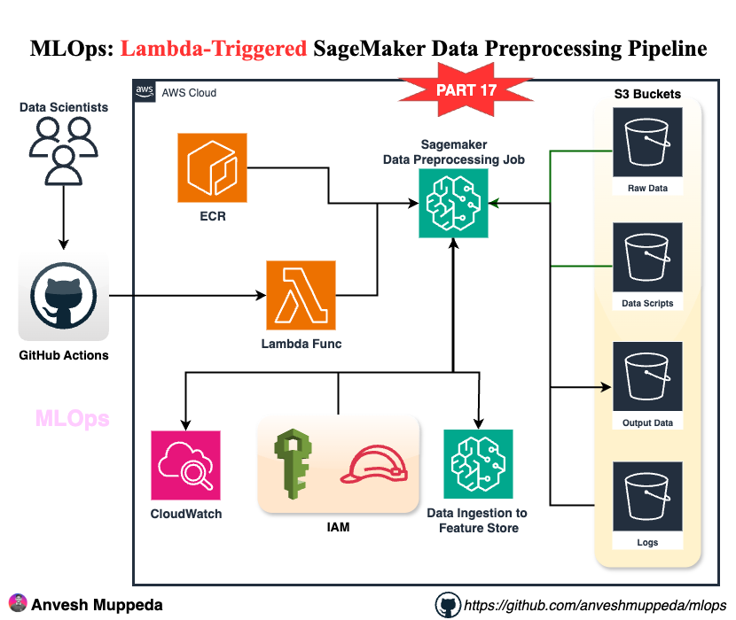

# Serverless MLOps: Lambda-Triggered SageMaker Data Preprocessing Pipeline
### A hands-on guide to building event-driven ML data processing with AWS Lambda, SageMaker, and CDK

## Overview

This advanced guide demonstrates building a **serverless MLOps pipeline** that combines:
- **AWS Lambda** for event-driven orchestration
- **SageMaker Processing Jobs** for scalable data preprocessing
- **S3 Event Triggers** for automated pipeline execution
- **CDK Infrastructure** for reproducible deployments
- **ECR Integration** for custom container management

## What You'll Build



### Architecture Components

1. **Lambda Function** - Orchestrates SageMaker processing jobs
2. **S3 Buckets** - Store raw data, processed data, scripts, and logs
3. **SageMaker Processing** - Execute data preprocessing at scale
4. **ECR Repository** - Store custom processing containers
5. **IAM Roles** - Secure cross-service permissions
6. **Event-Driven Triggers** - Automatic pipeline execution

## Prerequisites

- AWS Account with Lambda, SageMaker, and ECR permissions
- AWS CLI configured with appropriate credentials
- Python 3.8+ installed locally
- Node.js 18+ for AWS CDK
- Basic understanding of serverless architectures

## Step 1: Clone Repository and Setup

### Clone the MLOps Repository

```bash
git clone https://github.com/anveshmuppeda/mlops.git
cd mlops/016-cdk-lambda-preprocessing-pipeline
```

### Setup Python Environment

```bash
python3 -m venv .venv
source .venv/bin/activate  # Windows: .venv\Scripts\activate.bat
pip install -r requirements.txt
```

### Install AWS CDK (if not already installed)

```bash
npm install -g aws-cdk
cdk --version
```

## Step 2: Review Lambda-Driven Architecture

### Key Architecture Benefits

1. **Event-Driven Processing** - Automatic triggering on data arrival
2. **Serverless Orchestration** - No infrastructure management
3. **Cost Optimization** - Pay only for execution time
4. **Scalable Processing** - SageMaker handles compute scaling
5. **Flexible Triggers** - S3 events, manual invocation, or scheduled

### CDK Infrastructure Components

The `lambda_preprocessing_pipeline_stack.py` creates:

```python
# Lambda function for orchestration
data_preprocessing_function = _lambda.Function(
    function_name=f"{app_prefix}-data-preprocessing-function",
    runtime=_lambda.Runtime.PYTHON_3_13,
    handler="data_preprocessing_lambda.handler",
    timeout=Duration.minutes(15),
    environment={
        'APP_PREFIX': app_prefix,
        'PROCESSING_INSTANCE_TYPE': 'ml.t3.medium',
        'SAGEMAKER_ROLE_ARN': self.data_preprocessing_role.role_arn
    }
)
```

### Infrastructure Resources Created

| Resource | Purpose | Configuration |
|----------|---------|---------------|
| **Lambda Function** | Job orchestration | Python 3.13, 15min timeout |
| **S3 Buckets** | Data storage | 5 buckets for different purposes |
| **ECR Repository** | Container registry | Custom processing images |
| **IAM Roles** | Security | Lambda and SageMaker permissions |
| **SageMaker Role** | Processing execution | Full SageMaker and S3 access |

## Step 3: Understanding the Lambda Function

### Lambda Handler Logic

The `data_preprocessing_lambda.py` supports multiple trigger types:

```python
def handler(event, context):
    # Configuration from environment variables
    app_prefix = os.environ.get('APP_PREFIX')
    role_arn = os.environ.get('SAGEMAKER_ROLE_ARN')
    
    # Handle different trigger types
    if 'Records' in event:
        # S3 event trigger
        bucket_name = event['Records'][0]['s3']['bucket']['name']
        object_key = event['Records'][0]['s3']['object']['key']
        input_data_path = f's3://{bucket_name}/{os.path.dirname(object_key)}/'
    else:
        # Manual invocation
        input_data_path = event.get('input_data_path', f's3://{app_prefix}-raw-data-bucket/input/')
```

### Key Lambda Features

1. **Flexible Input Handling** - S3 events or manual triggers
2. **Dynamic Job Naming** - Timestamp-based unique names
3. **Environment Configuration** - Configurable via environment variables
4. **Error Handling** - Comprehensive exception management
5. **Response Formatting** - Structured JSON responses

### SageMaker Job Configuration

```python
response = sagemaker_client.create_processing_job(
    ProcessingJobName=job_name,
    RoleArn=role_arn,
    AppSpecification={
        'ImageUri': image_uri,
        'ContainerEntrypoint': ['python3', '/opt/ml/processing/input/code/preprocessing_script.py']
    },
    ProcessingInputs=[
        {
            'InputName': 'input-data',
            'S3Input': {
                'S3Uri': input_data_path,
                'LocalPath': '/opt/ml/processing/input'
            }
        }
    ]
)
```

## Step 4: Deploy the Infrastructure

### Bootstrap CDK (First Time Only)

```bash
cdk bootstrap
```

### Deploy the Stack

```bash
cdk deploy
```

### Verify Deployment

```bash
# Check Lambda function
aws lambda list-functions --query 'Functions[?contains(FunctionName, `lambda-preprocessing-pipeline`)]'

# Check S3 buckets
aws s3 ls | grep mlops-lambda-preprocessing-pipeline

# Check ECR repository
aws ecr describe-repositories --repository-names mlops-lambda-preprocessing-pipeline-sklearn-custom
```

## Step 5: Prepare Data and Scripts

### Upload Sample Data

```bash
# Upload the mock data to raw data bucket
aws s3 cp data/mock_data.csv s3://mlops-lambda-preprocessing-pipeline-raw-data-bucket/input/
```

### Create Preprocessing Script

Create a simple preprocessing script and upload it:

```python
# scripts/preprocessing_script.py
import pandas as pd
import json
import os
import sys

def main():
    # Read input data
    input_path = '/opt/ml/processing/input'
    output_path = '/opt/ml/processing/output'
    
    # Find CSV files
    csv_files = [f for f in os.listdir(input_path) if f.endswith('.csv')]
    
    for csv_file in csv_files:
        df = pd.read_csv(os.path.join(input_path, csv_file))
        
        # Basic preprocessing
        df_cleaned = df.dropna()
        df_cleaned['processed_timestamp'] = pd.Timestamp.now()
        
        # Save processed data
        output_file = f"processed_{csv_file}"
        df_cleaned.to_csv(os.path.join(output_path, output_file), index=False)
        
        print(f"Processed {csv_file} -> {output_file}")
        print(f"Original rows: {len(df)}, Cleaned rows: {len(df_cleaned)}")

if __name__ == "__main__":
    main()
```

### Upload Processing Script

```bash
aws s3 cp scripts/preprocessing_script.py s3://mlops-lambda-preprocessing-pipeline-model-artifacts-bucket/scripts/
```

## Step 6: Test Lambda Function

### Manual Invocation

```bash
# Test with manual trigger
aws lambda invoke \
  --function-name mlops-lambda-preprocessing-pipeline-data-preprocessing-function \
  --payload '{"input_data_path": "s3://mlops-lambda-preprocessing-pipeline-raw-data-bucket/input/"}' \
  response.json

# Check response
cat response.json
```

### Expected Response

```json
{
  "statusCode": 200,
  "body": "{\"message\": \"SageMaker processing job started successfully\", \"job_name\": \"preprocessing-job-20241201-143022\", \"job_arn\": \"arn:aws:sagemaker:us-east-1:123456789012:processing-job/preprocessing-job-20241201-143022\", \"console_url\": \"https://console.aws.amazon.com/sagemaker/home?region=us-east-1#/processing-jobs/preprocessing-job-20241201-143022\"}"
}
```

### Monitor Job Execution

```bash
# Check job status
aws sagemaker describe-processing-job --processing-job-name preprocessing-job-20241201-143022

# List all processing jobs
aws sagemaker list-processing-jobs --sort-by CreationTime --sort-order Descending
```

## Step 7: Setup S3 Event Triggers

### Configure S3 Event Notification

```bash
# Create event notification configuration
cat > event-config.json << EOF
{
  "LambdaConfigurations": [
    {
      "Id": "ProcessingTrigger",
      "LambdaFunctionArn": "arn:aws:lambda:us-east-1:YOUR_ACCOUNT:function:mlops-lambda-preprocessing-pipeline-data-preprocessing-function",
      "Events": ["s3:ObjectCreated:*"],
      "Filter": {
        "Key": {
          "FilterRules": [
            {
              "Name": "prefix",
              "Value": "input/"
            },
            {
              "Name": "suffix",
              "Value": ".csv"
            }
          ]
        }
      }
    }
  ]
}
EOF

# Apply notification configuration
aws s3api put-bucket-notification-configuration \
  --bucket mlops-lambda-preprocessing-pipeline-raw-data-bucket \
  --notification-configuration file://event-config.json
```

### Grant S3 Permission to Lambda

```bash
aws lambda add-permission \
  --function-name mlops-lambda-preprocessing-pipeline-data-preprocessing-function \
  --principal s3.amazonaws.com \
  --action lambda:InvokeFunction \
  --source-arn arn:aws:s3:::mlops-lambda-preprocessing-pipeline-raw-data-bucket \
  --statement-id s3-trigger-permission
```

## Step 8: Test Event-Driven Processing

### Upload Data to Trigger Pipeline

```bash
# Upload new data file to trigger processing
aws s3 cp data/mock_data.csv s3://mlops-lambda-preprocessing-pipeline-raw-data-bucket/input/new_data_$(date +%Y%m%d_%H%M%S).csv
```

### Monitor Automatic Execution

```bash
# Check Lambda logs
aws logs describe-log-groups --log-group-name-prefix /aws/lambda/mlops-lambda-preprocessing-pipeline

# Get recent log events
aws logs filter-log-events \
  --log-group-name /aws/lambda/mlops-lambda-preprocessing-pipeline-data-preprocessing-function \
  --start-time $(date -d '10 minutes ago' +%s)000
```

### Verify Processing Results

```bash
# Check processed data
aws s3 ls s3://mlops-lambda-preprocessing-pipeline-processed-data-bucket/output/ --recursive

# Download and inspect results
aws s3 cp s3://mlops-lambda-preprocessing-pipeline-processed-data-bucket/output/processed_new_data_20241201_143022.csv ./
```

## Step 9: Advanced Lambda Configuration

### Environment Variables

The Lambda function uses these environment variables:

| Variable | Purpose | Default Value |
|----------|---------|---------------|
| `APP_PREFIX` | Resource naming | `mlops-lambda-preprocessing-pipeline` |
| `PROCESSING_INSTANCE_TYPE` | SageMaker instance | `ml.t3.medium` |
| `PROCESSING_INSTANCE_COUNT` | Number of instances | `1` |
| `SKLEARN_VERSION` | Container version | `1.2-1` |
| `SAGEMAKER_ROLE_ARN` | Execution role | Auto-configured |

### Update Lambda Configuration

```bash
# Update environment variables
aws lambda update-function-configuration \
  --function-name mlops-lambda-preprocessing-pipeline-data-preprocessing-function \
  --environment Variables='{
    "APP_PREFIX":"mlops-lambda-preprocessing-pipeline",
    "PROCESSING_INSTANCE_TYPE":"ml.m5.large",
    "PROCESSING_INSTANCE_COUNT":"2"
  }'
```

### Lambda Function Monitoring

```bash
# Get function metrics
aws cloudwatch get-metric-statistics \
  --namespace AWS/Lambda \
  --metric-name Duration \
  --dimensions Name=FunctionName,Value=mlops-lambda-preprocessing-pipeline-data-preprocessing-function \
  --start-time $(date -d '1 hour ago' -u +%Y-%m-%dT%H:%M:%S) \
  --end-time $(date -u +%Y-%m-%dT%H:%M:%S) \
  --period 300 \
  --statistics Average,Maximum
```

## Step 10: Custom Processing Containers

### Build Custom Container

```dockerfile
# Dockerfile for custom processing
FROM 683313688378.dkr.ecr.us-east-1.amazonaws.com/sagemaker-scikit-learn:1.2-1-cpu-py3

ENV PYTHONUNBUFFERED=1

# Install additional dependencies
RUN pip install --no-cache-dir \
    pandas>=2.0.0 \
    numpy>=1.24.0 \
    scikit-learn>=1.3.0

# Copy custom processing scripts
COPY scripts/ /opt/ml/processing/scripts/

WORKDIR /opt/ml/processing
```

### Build and Push to ECR

```bash
# Get ECR login token
aws ecr get-login-password --region us-east-1 | docker login --username AWS --password-stdin 683313688378.dkr.ecr.us-east-1.amazonaws.com

# Build custom image
docker build -t lambda-preprocessing-custom .

# Tag for ECR
docker tag lambda-preprocessing-custom:latest YOUR_ACCOUNT.dkr.ecr.us-east-1.amazonaws.com/mlops-lambda-preprocessing-pipeline-sklearn-custom:latest

# Push to ECR
docker push YOUR_ACCOUNT.dkr.ecr.us-east-1.amazonaws.com/mlops-lambda-preprocessing-pipeline-sklearn-custom:latest
```

### Update Lambda to Use Custom Container

```python
# Update image_uri in Lambda function
image_uri = f"{account_id}.dkr.ecr.{aws_region}.amazonaws.com/mlops-lambda-preprocessing-pipeline-sklearn-custom:latest"
```

## Step 11: Error Handling and Monitoring

### Lambda Error Handling

The function includes comprehensive error handling:

```python
try:
    response = sagemaker_client.create_processing_job(...)
    return {
        'statusCode': 200,
        'body': json.dumps({
            'message': 'SageMaker processing job started successfully',
            'job_name': job_name,
            'job_arn': job_arn
        })
    }
except Exception as e:
    print(f"Error creating SageMaker processing job: {str(e)}")
    return {
        'statusCode': 500,
        'body': json.dumps({
            'message': 'Failed to create SageMaker processing job',
            'error': str(e)
        })
    }
```

### CloudWatch Monitoring

```bash
# Create custom metric filter
aws logs put-metric-filter \
  --log-group-name /aws/lambda/mlops-lambda-preprocessing-pipeline-data-preprocessing-function \
  --filter-name ProcessingJobErrors \
  --filter-pattern "ERROR" \
  --metric-transformations \
    metricName=ProcessingJobErrors,metricNamespace=MLOps/Lambda,metricValue=1

# Create CloudWatch alarm
aws cloudwatch put-metric-alarm \
  --alarm-name "Lambda-Processing-Errors" \
  --alarm-description "Alert on Lambda processing errors" \
  --metric-name ProcessingJobErrors \
  --namespace MLOps/Lambda \
  --statistic Sum \
  --period 300 \
  --threshold 1 \
  --comparison-operator GreaterThanOrEqualToThreshold \
  --evaluation-periods 1
```

## Step 12: Performance Optimization

### Lambda Optimization

1. **Memory Configuration**
```bash
aws lambda update-function-configuration \
  --function-name mlops-lambda-preprocessing-pipeline-data-preprocessing-function \
  --memory-size 1024
```

2. **Timeout Adjustment**
```bash
aws lambda update-function-configuration \
  --function-name mlops-lambda-preprocessing-pipeline-data-preprocessing-function \
  --timeout 900  # 15 minutes
```

### SageMaker Processing Optimization

1. **Instance Type Selection**
   - `ml.t3.medium` - General purpose, cost-effective
   - `ml.m5.large` - Balanced compute and memory
   - `ml.c5.xlarge` - Compute optimized

2. **Parallel Processing**
```python
# Update Lambda to support multiple instances
processing_instance_count = int(os.environ.get('PROCESSING_INSTANCE_COUNT', '2'))
```

### Cost Optimization Strategies

| Strategy | Implementation | Savings |
|----------|----------------|---------|
| **Spot Instances** | Use managed spot training | Up to 70% |
| **Right-sizing** | Monitor and adjust instance types | 20-40% |
| **Lifecycle Policies** | Auto-delete old S3 objects | 30-50% |
| **Reserved Capacity** | For predictable workloads | 20-30% |

## Step 13: Security Best Practices

### IAM Role Permissions

The CDK stack creates minimal required permissions:

```python
# SageMaker execution role
self.data_preprocessing_role.add_to_policy(
    iam.PolicyStatement(
        actions=["s3:GetObject", "s3:PutObject", "s3:ListBucket"],
        resources=[
            f"{self.raw_data_bucket.bucket_arn}/*",
            f"{self.processed_data_bucket.bucket_arn}/*"
        ]
    )
)

# Lambda execution role
data_preprocessing_lambda_role = iam.Role(
    assumed_by=iam.ServicePrincipal("lambda.amazonaws.com"),
    managed_policies=[
        iam.ManagedPolicy.from_aws_managed_policy_name("service-role/AWSLambdaBasicExecutionRole"),
        iam.ManagedPolicy.from_aws_managed_policy_name("AmazonSageMakerFullAccess")
    ]
)
```

### S3 Bucket Security

```bash
# Enable bucket encryption
aws s3api put-bucket-encryption \
  --bucket mlops-lambda-preprocessing-pipeline-raw-data-bucket \
  --server-side-encryption-configuration '{
    "Rules": [{
      "ApplyServerSideEncryptionByDefault": {
        "SSEAlgorithm": "AES256"
      }
    }]
  }'

# Block public access
aws s3api put-public-access-block \
  --bucket mlops-lambda-preprocessing-pipeline-raw-data-bucket \
  --public-access-block-configuration \
    BlockPublicAcls=true,IgnorePublicAcls=true,BlockPublicPolicy=true,RestrictPublicBuckets=true
```

## Step 14: Troubleshooting Guide

### Common Issues and Solutions

#### Issue: Lambda Function Timeout

**Symptoms**: Function times out before SageMaker job starts
**Solution**: Increase Lambda timeout
```bash
aws lambda update-function-configuration \
  --function-name mlops-lambda-preprocessing-pipeline-data-preprocessing-function \
  --timeout 900
```

#### Issue: SageMaker Job Fails to Start

**Symptoms**: Job creation fails with permission errors
**Solution**: Check IAM role permissions
```bash
# Verify role exists and has correct permissions
aws iam get-role --role-name mlops-lambda-preprocessing-pipeline-data-preprocessing-role
aws iam list-attached-role-policies --role-name mlops-lambda-preprocessing-pipeline-data-preprocessing-role
```

#### Issue: S3 Event Not Triggering Lambda

**Symptoms**: File uploads don't trigger processing
**Solution**: Verify S3 event configuration
```bash
# Check bucket notification configuration
aws s3api get-bucket-notification-configuration \
  --bucket mlops-lambda-preprocessing-pipeline-raw-data-bucket

# Verify Lambda permissions
aws lambda get-policy \
  --function-name mlops-lambda-preprocessing-pipeline-data-preprocessing-function
```

#### Issue: Processing Script Not Found

**Symptoms**: SageMaker job fails with script not found error
**Solution**: Verify script upload and path
```bash
# Check script exists in S3
aws s3 ls s3://mlops-lambda-preprocessing-pipeline-model-artifacts-bucket/scripts/

# Verify script path in Lambda function
aws lambda get-function-configuration \
  --function-name mlops-lambda-preprocessing-pipeline-data-preprocessing-function
```

### Debug Lambda Function

```bash
# Enable detailed logging
aws lambda update-function-configuration \
  --function-name mlops-lambda-preprocessing-pipeline-data-preprocessing-function \
  --environment Variables='{
    "APP_PREFIX":"mlops-lambda-preprocessing-pipeline",
    "LOG_LEVEL":"DEBUG"
  }'

# View recent logs
aws logs tail /aws/lambda/mlops-lambda-preprocessing-pipeline-data-preprocessing-function --follow
```

## Step 15: Production Deployment

### Multi-Environment Setup

```bash
# Deploy to different environments
cdk deploy --context environment=dev
cdk deploy --context environment=staging  
cdk deploy --context environment=prod
```

### CI/CD Pipeline Integration

```yaml
# .github/workflows/deploy-lambda-pipeline.yml
name: Deploy Lambda Processing Pipeline

on:
  push:
    branches: [main]
    paths: ['016-cdk-lambda-preprocessing-pipeline/**']

jobs:
  deploy:
    runs-on: ubuntu-latest
    steps:
      - uses: actions/checkout@v3
      
      - name: Setup Node.js
        uses: actions/setup-node@v3
        with:
          node-version: '18'
          
      - name: Setup Python
        uses: actions/setup-python@v4
        with:
          python-version: '3.9'
          
      - name: Install dependencies
        run: |
          cd 016-cdk-lambda-preprocessing-pipeline
          npm install -g aws-cdk
          pip install -r requirements.txt
          
      - name: Deploy CDK Stack
        run: |
          cd 016-cdk-lambda-preprocessing-pipeline
          cdk deploy --require-approval never
        env:
          AWS_ACCESS_KEY_ID: ${{ secrets.AWS_ACCESS_KEY_ID }}
          AWS_SECRET_ACCESS_KEY: ${{ secrets.AWS_SECRET_ACCESS_KEY }}
          AWS_DEFAULT_REGION: us-east-1
```

### Monitoring and Alerting

```bash
# Create comprehensive monitoring dashboard
aws cloudwatch put-dashboard \
  --dashboard-name "MLOps-Lambda-Pipeline" \
  --dashboard-body '{
    "widgets": [
      {
        "type": "metric",
        "properties": {
          "metrics": [
            ["AWS/Lambda", "Duration", "FunctionName", "mlops-lambda-preprocessing-pipeline-data-preprocessing-function"],
            ["AWS/Lambda", "Errors", "FunctionName", "mlops-lambda-preprocessing-pipeline-data-preprocessing-function"],
            ["AWS/SageMaker", "ProcessingJobs", "JobStatus", "InProgress"],
            ["AWS/SageMaker", "ProcessingJobs", "JobStatus", "Completed"]
          ],
          "period": 300,
          "stat": "Sum",
          "region": "us-east-1",
          "title": "Lambda and SageMaker Metrics"
        }
      }
    ]
  }'
```

## Step 16: Cleanup Resources

### Delete Processing Jobs

```bash
# List and stop running jobs
aws sagemaker list-processing-jobs --status-equals InProgress --query 'ProcessingJobSummaries[].ProcessingJobName' --output text | \
xargs -I {} aws sagemaker stop-processing-job --processing-job-name {}
```

### Remove S3 Objects

```bash
# Empty all buckets
aws s3 rm s3://mlops-lambda-preprocessing-pipeline-raw-data-bucket --recursive
aws s3 rm s3://mlops-lambda-preprocessing-pipeline-processed-data-bucket --recursive
aws s3 rm s3://mlops-lambda-preprocessing-pipeline-model-artifacts-bucket --recursive
aws s3 rm s3://mlops-lambda-preprocessing-pipeline-logs-bucket --recursive
aws s3 rm s3://mlops-lambda-preprocessing-pipeline-feature-store-bucket --recursive
```

### Destroy CDK Stack

```bash
cdk destroy
```

### Remove ECR Images

```bash
# Delete all images in repository
aws ecr batch-delete-image \
  --repository-name mlops-lambda-preprocessing-pipeline-sklearn-custom \
  --image-ids imageTag=latest
```

## Key Learnings and Best Practices

### Architecture Benefits

1. **Event-Driven Processing** - Automatic pipeline execution
2. **Serverless Orchestration** - No infrastructure management
3. **Cost Efficiency** - Pay-per-execution model
4. **Scalability** - Automatic scaling with demand
5. **Flexibility** - Multiple trigger mechanisms

### Technical Concepts Mastered

1. **Lambda Function Design** - Event handling and orchestration
2. **SageMaker Integration** - Programmatic job creation
3. **S3 Event Triggers** - Automated pipeline activation
4. **IAM Security** - Cross-service permissions
5. **CDK Infrastructure** - Infrastructure as code

### Production Considerations

1. **Error Handling** - Comprehensive exception management
2. **Monitoring** - CloudWatch metrics and alarms
3. **Security** - Least privilege access
4. **Cost Optimization** - Right-sizing and lifecycle policies
5. **Scalability** - Auto-scaling configurations

### MLOps Best Practices

1. **Separation of Concerns** - Lambda for orchestration, SageMaker for processing
2. **Event-Driven Architecture** - Reactive pipeline execution
3. **Infrastructure as Code** - Reproducible deployments
4. **Monitoring and Observability** - Comprehensive logging
5. **Security First** - Encrypted storage and secure access

## Next Steps and Extensions

### Immediate Enhancements

1. **Add Data Validation** - Schema validation before processing
2. **Implement Dead Letter Queues** - Handle failed executions
3. **Add Step Functions** - Complex workflow orchestration
4. **Integrate SNS Notifications** - Job completion alerts

### Advanced Features

1. **Multi-Stage Pipelines** - Chain multiple processing steps
2. **A/B Testing** - Parallel processing paths
3. **Model Training Integration** - Connect to training workflows
4. **Real-time Streaming** - Kinesis integration
5. **Cross-Region Deployment** - Multi-region processing

### Integration Opportunities

1. **API Gateway** - REST API for manual triggers
2. **EventBridge** - Complex event routing
3. **SQS Integration** - Queue-based processing
4. **DynamoDB** - Job state tracking
5. **CloudFormation** - Alternative IaC approach

## Summary

This serverless MLOps pipeline demonstrates:

✅ **Event-Driven Architecture** - Automatic processing on data arrival  
✅ **Serverless Orchestration** - Lambda-based job management  
✅ **Scalable Processing** - SageMaker for compute-intensive tasks  
✅ **Infrastructure as Code** - CDK for reproducible deployments  
✅ **Cost Optimization** - Pay-per-execution model  
✅ **Security Best Practices** - IAM roles and encrypted storage  
✅ **Production Ready** - Monitoring, error handling, and CI/CD  

The pipeline automatically processes data uploaded to S3, executes SageMaker processing jobs via Lambda orchestration, and stores results for downstream consumption - all with minimal operational overhead.

---

**Author**: Anvesh Muppeda  
**Project**: MLOps with AWS  
**Repository**: [github.com/anveshmuppeda/mlops](https://github.com/anveshmuppeda/mlops)  
**Blog**: [Medium @muppedaanvesh](https://medium.com/@muppedaanvesh)