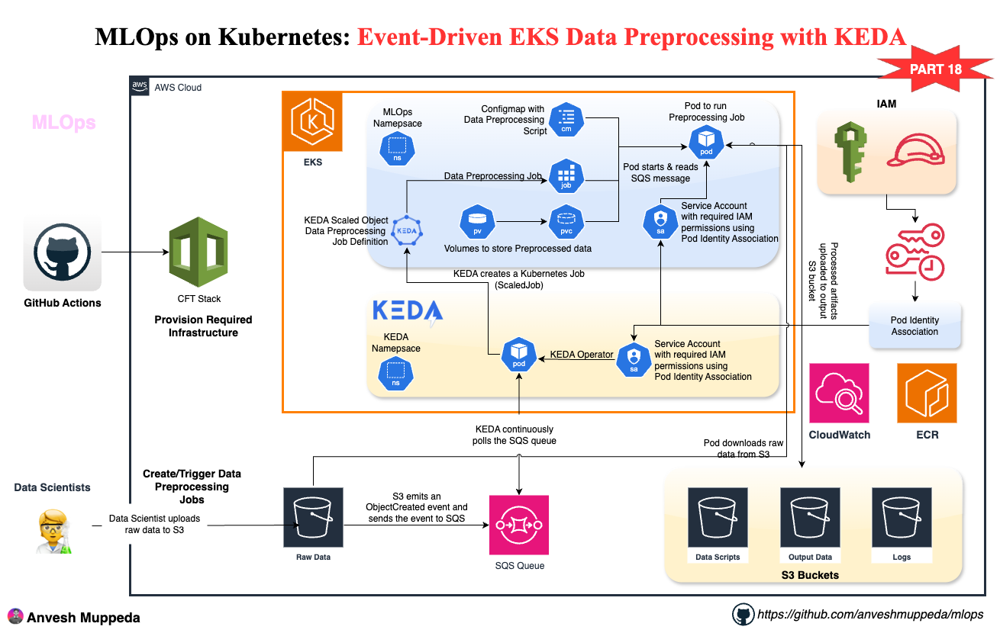

# MLOps on Kubernetes: Event-Driven EKS Data Preprocessing with KEDA
### A hands-on guide to building automated, event-driven ML data processing pipelines using Amazon EKS, S3, SQS, and KEDA

## Overview

This comprehensive guide demonstrates building a **production-grade event-driven MLOps data preprocessing pipeline** that automatically processes data when files are uploaded to S3. The architecture combines:

- **Amazon EKS** for container orchestration
- **Amazon S3** for data storage with event notifications
- **Amazon SQS** for reliable message queuing
- **KEDA** for event-driven autoscaling
- **EKS Pod Identity** for secure AWS service access
- **SageMaker Containers** for ML-optimized processing

## What You'll Build



### Architecture Flow

1. **File Upload** → S3 bucket receives new data files
2. **Event Notification** → S3 sends event to SQS queue
3. **Auto Scaling** → KEDA detects SQS messages and scales jobs
4. **Processing** → EKS jobs process data using SageMaker containers
5. **Output** → Processed data saved back to S3
6. **Cleanup** → SQS messages deleted after successful processing

### Key Components

| Component | Purpose | Technology |
|-----------|---------|------------|
| **S3 Buckets** | Raw and processed data storage | Amazon S3 |
| **SQS Queue** | Event message queuing | Amazon SQS |
| **EKS Cluster** | Container orchestration | Amazon EKS |
| **KEDA** | Event-driven autoscaling | Kubernetes Event-driven Autoscaler |
| **ScaledJob** | Auto-scaling job controller | KEDA ScaledJob |
| **Pod Identity** | Secure AWS authentication | EKS Pod Identity |

## Prerequisites

- AWS Account with EKS, S3, SQS, and IAM permissions
- AWS CLI configured with appropriate credentials
- kubectl installed and configured
- Python 3.8+ and Node.js 18+ for CDK
- Basic understanding of Kubernetes, S3 events, and SQS

## Step 1: Clone Repository and Setup

### Clone the MLOps Repository

```bash
git clone https://github.com/anveshmuppeda/mlops.git
cd mlops/018-eks-eventdriven-preprocessing
```

### Setup CDK Environment

```bash
cd cdk-eks-cluster-stack
python3 -m venv .venv
source .venv/bin/activate  # Windows: .venv\Scripts\activate.bat
pip install -r requirements.txt
npm install -g aws-cdk
```

## Step 2: Deploy EKS Infrastructure

### Bootstrap and Deploy CDK Stacks

```bash
# Bootstrap CDK (first time only)
cdk bootstrap

# Deploy network infrastructure
cdk deploy NetworkStack

# Deploy EKS cluster with S3 and SQS
cdk deploy EksClusterStack2
```

### Configure kubectl

```bash
aws eks update-kubeconfig --region us-east-1 --name eks-eventdriven-preprocessing-eks-cluster
kubectl get nodes
```

## Step 3: Install KEDA

### Install KEDA using Helm

```bash
# Add KEDA Helm repository
helm repo add kedacore https://kedacore.github.io/charts
helm repo update

# Install KEDA
helm install keda kedacore/keda --namespace keda-system --create-namespace

# Verify KEDA installation
kubectl get pods -n keda-system
```

## Step 4: Verify Pod Identity Association
### Verify Pod Identity Setup

```bash
# Check Pod Identity associations
aws eks list-pod-identity-associations --cluster-name eks-eventdriven-preprocessing-eks-cluster

# Verify Pod Identity agent
kubectl get pods -n kube-system | grep pod-identity
```

## Step 5: Understanding the Kubernetes Manifests

### Manifest Files Overview

The `manifests/` directory contains three key files:

| File | Purpose | Description |
|------|---------|-------------|
| `TriggerAuthentication.yaml` | KEDA authentication | Configures Pod Identity for KEDA |
| `cm.yaml` | Processing script | Contains the data preprocessing logic |
| `scaledobject.yaml` | KEDA ScaledJob | Defines auto-scaling job configuration |

### TriggerAuthentication Configuration

The `TriggerAuthentication.yaml` configures KEDA to use Pod Identity:

```yaml
apiVersion: keda.sh/v1alpha1
kind: TriggerAuthentication
metadata:
  name: aws-pod-identity-auth
  namespace: mlops
spec:
  podIdentity:
    provider: aws
```

### ConfigMap with Processing Script

The `cm.yaml` contains the complete data preprocessing script that:
- Upgrades boto3 for Pod Identity support
- Polls SQS for S3 event messages
- Downloads and processes data
- Uploads results to S3
- Deletes processed messages

### ScaledJob Configuration

The `scaledobject.yaml` defines the KEDA ScaledJob with:
- Service account for Pod Identity
- Container specification with SageMaker image
- Environment variables for S3 buckets and SQS queue
- Resource limits and requests
- SQS trigger configuration

## Step 6: Understanding the Event-Driven Architecture

### S3 Event Configuration

The CDK automatically configures S3 to send events to SQS:

```python
# S3 bucket with SQS event notification
self.raw_data_bucket.add_event_notification(
    s3.EventType.OBJECT_CREATED,
    s3n.SqsDestination(self.s3_event_queue)
)
```

### SQS Queue Setup

```python
# SQS queue for S3 events
self.s3_event_queue = sqs.Queue(
    queue_name=f"{app_prefix}-s3-event-queue",
    visibility_timeout=Duration.minutes(15),
    message_retention_period=Duration.days(14)
)
```

### KEDA ScaledJob Configuration

The `scaledobject.yaml` contains a KEDA ScaledJob that scales based on SQS queue length:

```yaml
apiVersion: keda.sh/v1alpha1
kind: ScaledJob
metadata:
  name: data-preprocessing-job
  namespace: mlops
spec:
  minReplicaCount: 0
  maxReplicaCount: 10
  pollingInterval: 30
  
  triggers:
  - type: aws-sqs-queue
    authenticationRef:
      name: aws-pod-identity-auth
    metadata:
      queueURL: https://sqs.us-east-1.amazonaws.com/1234567890/eks-eventdriven-preprocessing-s3-event-queue
      awsRegion: us-east-1
      messageReceiptThreshold: "1"
```

## Step 7: Deploy the Processing Pipeline

### Create MLOps Namespace

```bash
kubectl create namespace mlops
```

### Deploy Kubernetes Manifests

```bash
# Deploy KEDA trigger authentication
kubectl apply -f manifests/TriggerAuthentication.yaml

# Deploy preprocessing script ConfigMap
kubectl apply -f manifests/cm.yaml

# Deploy KEDA ScaledJob
kubectl apply -f manifests/scaledobject.yaml
```

### Verify Deployment

```bash
# Check KEDA ScaledJob
kubectl get scaledjob -n mlops

# Check trigger authentication
kubectl get triggerauthentication -n mlops

# Verify no jobs are running (queue is empty)
kubectl get jobs -n mlops
```

## Step 8: Understanding the Processing Script

### Event-Driven Processing Logic

The preprocessing script automatically:

1. **Upgrades boto3** for Pod Identity support
2. **Polls SQS queue** for S3 event messages
3. **Parses S3 event** to get bucket and object key
4. **Downloads data** from S3
5. **Processes data** (cleaning, transformation, feature engineering)
6. **Uploads results** to output S3 bucket
7. **Deletes SQS message** to prevent reprocessing

### Key Script Components

```python
# Upgrade boto3 for Pod Identity
subprocess.check_call([sys.executable, "-m", "pip", "install", "--upgrade", "boto3>=1.28.0"])

# Poll SQS for messages
sqs_client = boto3.client("sqs")
response = sqs_client.receive_message(
    QueueUrl=sqs_queue_url,
    MaxNumberOfMessages=1,
    WaitTimeSeconds=10
)

# Parse S3 event from SQS message
event = json.loads(sqs_message)
record = event["Records"][0]
input_bucket = record["s3"]["bucket"]["name"]
input_key = record["s3"]["object"]["key"]

# Process data and upload results
# ... data processing logic ...

# Delete processed message
sqs_client.delete_message(QueueUrl=sqs_queue_url, ReceiptHandle=receipt_handle)
```

## Step 9: Test the Event-Driven Pipeline

### Upload Test Data

```bash
# Upload sample data to trigger processing
aws s3 cp data/mock_data.csv s3://eks-eventdriven-preprocessing-raw-data-bucket/input/

# Check SQS queue for messages
aws sqs get-queue-attributes \
  --queue-url https://sqs.us-east-1.amazonaws.com/1234567890/eks-eventdriven-preprocessing-s3-event-queue \
  --attribute-names ApproximateNumberOfMessages
```

### Monitor Auto-Scaling

```bash
# Watch KEDA scale up jobs
kubectl get jobs -n mlops -w

# Monitor job pods
kubectl get pods -n mlops -w

# Check KEDA metrics
kubectl get hpa -n mlops
```

### View Processing Logs

```bash
# Get job pod name
kubectl get pods -n mlops

# View processing logs
kubectl logs <job-pod-name> -n mlops -f
```

### Expected Log Output

```
📦 Upgrading boto3 to support EKS Pod Identity...
✅ boto3 upgraded successfully
📨 Received SQS message: {"Records":[{"eventVersion":"2.1","eventSource":"aws:s3"...
📥 Processing S3 object: s3://eks-eventdriven-preprocessing-raw-data-bucket/input/mock_data.csv
📤 Output bucket: eks-eventdriven-preprocessing-processed-data-bucket
🔐 S3 client initialized using EKS Pod Identity
📥 Downloading file...
✅ Dataset loaded with shape: (50000, 8)
📊 Filling missing values...
🔧 Extracting profile fields...
✅ Saved cleaned_data.csv
✅ Saved transformed_data.csv
📤 Uploading s3://eks-eventdriven-preprocessing-processed-data-bucket/output/cleaned_data_20241221-235959.csv
🎉 Preprocessing completed successfully!
✅ SQS message deleted successfully
```

## Step 10: Verify Results

### Check Processed Data

```bash
# List processed files
aws s3 ls s3://eks-eventdriven-preprocessing-processed-data-bucket/output/ --recursive

# Download and inspect results
aws s3 cp s3://eks-eventdriven-preprocessing-processed-data-bucket/output/cleaned_data_20241221-235959.csv ./
head -5 cleaned_data_20241221-235959.csv
```

### Monitor Queue Status

```bash
# Check queue is empty after processing
aws sqs get-queue-attributes \
  --queue-url https://sqs.us-east-1.amazonaws.com/1234567890/eks-eventdriven-preprocessing-s3-event-queue \
  --attribute-names ApproximateNumberOfMessages

# Verify jobs scaled down to zero
kubectl get jobs -n mlops
```

## Step 11: Advanced Configuration

### Scaling Parameters

Adjust KEDA scaling behavior in `scaledobject.yaml`:

```yaml
spec:
  minReplicaCount: 0          # Scale to zero when no messages
  maxReplicaCount: 10         # Maximum concurrent jobs
  pollingInterval: 30         # Check queue every 30 seconds
  failedJobsHistoryLimit: 5   # Keep 5 failed jobs for debugging
``` jobs for debugging
```

### Resource Management

Configure resource requests and limits:

```yaml
resources:
  requests:
    memory: "1Gi"
    cpu: "500m"
  limits:
    memory: "4Gi"
    cpu: "2000m"
```

### Message Handling

Configure SQS message handling:

```yaml
metadata:
  messageReceiptThreshold: "1"  # Scale when 1+ messages
  awsRegion: us-east-1
  queueURL: <your-queue-url>
```

## Step 12: Troubleshooting Guide

### Common Issues and Solutions

#### Issue: Jobs Not Scaling Up

**Symptoms**: No jobs created despite messages in queue
**Solution**: Check KEDA configuration and authentication

```bash
# Check KEDA operator logs
kubectl logs -n keda-system deployment/keda-operator

# Verify trigger authentication
kubectl describe triggerauthentication aws-pod-identity-auth -n mlops

# Check ScaledJob status
kubectl describe scaledjob data-preprocessing-job -n mlops
```

#### Issue: Pod Identity Authentication Fails

**Symptoms**: AWS credential errors in job logs
**Solution**: Verify Pod Identity association

```bash
# Check Pod Identity associations
aws eks describe-pod-identity-association --cluster-name eks-eventdriven-preprocessing-eks-cluster --association-id <id>

# Verify service account
kubectl get sa data-preprocessing-sa -n mlops -o yaml
```

#### Issue: SQS Messages Not Deleted

**Symptoms**: Messages reprocessed multiple times
**Solution**: Check message deletion logic

```bash
# Monitor SQS queue attributes
aws sqs get-queue-attributes --queue-url <queue-url> --attribute-names All

# Check job completion status
kubectl get jobs -n mlops -o wide
```

### Debug Commands

```bash
# Check KEDA metrics
kubectl get --raw /apis/external.metrics.k8s.io/v1beta1 | jq .

# View KEDA scaler logs
kubectl logs -n keda-system deployment/keda-metrics-apiserver

# Check job events
kubectl describe job <job-name> -n mlops

# Monitor SQS queue
watch 'aws sqs get-queue-attributes --queue-url <queue-url> --attribute-names ApproximateNumberOfMessages'
```

## Step 13: Production Considerations

### Security Best Practices

- **Network Policies**: Restrict pod-to-pod communication
- **Pod Security Standards**: Enforce security contexts
- **IAM Least Privilege**: Minimal required permissions
- **Secrets Management**: Use AWS Secrets Manager for sensitive data

### Monitoring and Alerting

```yaml
# CloudWatch metrics for SQS
- QueueDepth
- NumberOfMessagesSent
- NumberOfMessagesReceived
- ApproximateAgeOfOldestMessage

# EKS metrics
- Pod CPU/Memory usage
- Job success/failure rates
- KEDA scaling events
```

### Cost Optimization

- **Spot Instances**: Use spot instances for worker nodes
- **Resource Limits**: Set appropriate CPU/memory limits
- **Auto-scaling**: Configure cluster autoscaler
- **Queue Retention**: Set appropriate message retention periods

## Step 14: Cleanup Resources

### Delete Kubernetes Resources

```bash
kubectl delete namespace mlops
helm uninstall keda -n keda-system
kubectl delete namespace keda-system
```

### Remove S3 Objects

```bash
aws s3 rm s3://eks-eventdriven-preprocessing-raw-data-bucket --recursive
aws s3 rm s3://eks-eventdriven-preprocessing-processed-data-bucket --recursive
```

### Destroy CDK Stacks

```bash
cdk destroy EksClusterStack2
cdk destroy NetworkStack
```

## Key Benefits of Event-Driven Architecture

### Scalability
- **Auto-scaling**: Automatically scales based on workload
- **Zero-cost idle**: No resources consumed when no data to process
- **Parallel processing**: Multiple jobs can process different files simultaneously

### Reliability
- **Message durability**: SQS ensures messages aren't lost
- **Retry mechanism**: Failed jobs can be retried automatically
- **Dead letter queues**: Handle poison messages gracefully

### Cost Efficiency
- **Pay-per-use**: Only pay for compute when processing data
- **Spot instances**: Use cheaper spot instances for batch processing
- **Resource optimization**: Right-size containers based on workload

### Operational Excellence
- **Monitoring**: Built-in CloudWatch metrics and logging
- **Debugging**: Job history and logs for troubleshooting
- **Maintenance**: Kubernetes handles container lifecycle

## Next Steps and Extensions

### Immediate Enhancements

1. **Add Data Validation** - Schema validation before processing
2. **Implement Dead Letter Queue** - Handle failed messages
3. **Add Monitoring Dashboard** - Grafana dashboard for metrics
4. **Configure Alerts** - CloudWatch alarms for failures

### Advanced Features

1. **Multi-Stage Processing** - Chain multiple processing steps
2. **GPU Workloads** - Add GPU nodes for ML training
3. **Streaming Processing** - Real-time data processing with Kafka
4. **Model Training Pipeline** - Extend to include model training

### Integration Opportunities

1. **Apache Airflow** - Orchestrate complex ML workflows
2. **MLflow** - Track experiments and model versions
3. **Feature Store** - SageMaker Feature Store integration
4. **Model Registry** - Centralized model management

## Summary

This event-driven EKS MLOps pipeline demonstrates:

✅ **Fully Automated Processing** - No manual intervention required  
✅ **Event-Driven Architecture** - Processes data as soon as it arrives  
✅ **Auto-Scaling** - Scales from 0 to N based on queue depth  
✅ **Cost Efficient** - Pay only for actual processing time  
✅ **Reliable Message Handling** - SQS ensures no data loss  
✅ **Secure AWS Integration** - Pod Identity for seamless authentication  
✅ **Production Ready** - Monitoring, logging, and error handling  

The pipeline automatically triggers data preprocessing jobs whenever new files are uploaded to S3, demonstrating a modern, serverless-like approach to MLOps using Kubernetes and KEDA.

---

**Author**: Anvesh Muppeda  
**Project**: MLOps with AWS  
**Repository**: [github.com/anveshmuppeda/mlops](https://github.com/anveshmuppeda/mlops)  
**Blog**: [Medium @muppedaanvesh](https://medium.com/@muppedaanvesh)